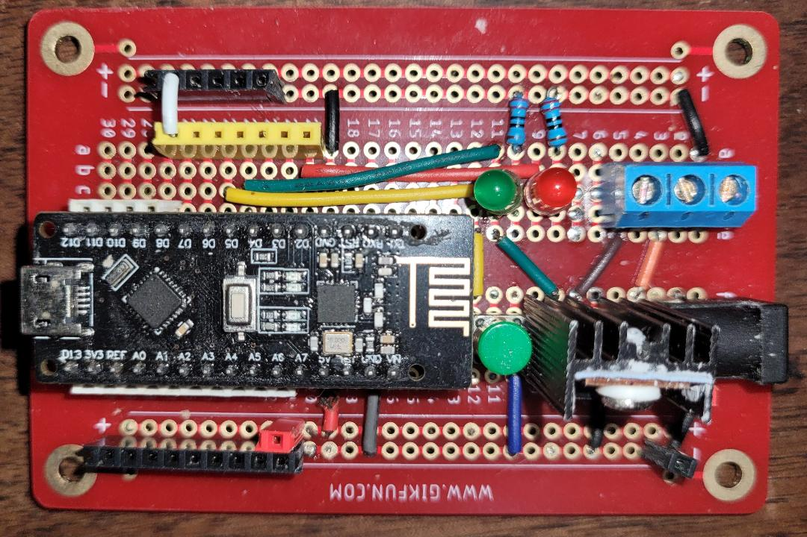

# morseR24

An Arduino sketch that converts text to Morse code and other formats, outputs to GPIO, and can transmit message to slave devices using an nRF24L01 radio.

It can store up to 4 different messages of up to 240 characters each (selectable by jumpers.)

## Hardware requirements

This project was developed using the Arduino Nano V3, and a compatible board with integrated nRF24L01 radio.

Arduino Uno will work, but lacks support for PWM output.

## Software requirements

Install the RF24 library from TMRh20,Avamander version 1.4.7 or greater.

## Initialization

Upload **morse/morse.ino**. The sketch will work initially with Arduino factory settings (EEPROM set to all 0xFF). If it is a used Arduino, the safest thing to is, upload **eeprom_reset/eeprom_reset.ino** first to reset the EEPROM. Then reupload **morse/morse.ino**.

## Wiring

The output pin is D5 and the inverted output is D3.

Many behaviours of the device are determined by jumper wirings to ground on various GPIO input pins. See below for the details of each of these. Jumper settings are only detected at setup (reset) of the Arduino.

Here are the descriptions of each pin. All INPUT_PULLUP pins are active-low according to the function described:

| Pin | mode         | function               |
|-----|--------------|------------------------|
| D2  | OUTPUT       | error/status signal    |
| D3  | OUTPUT       | inverted Morse signal  |
| D4  | INPUT_PULLUP | disable radio          |
| D5  | OUTPUT       | Morse signal (PWM)     |
| D6  | INPUT_PULLUP | code key switch        |
| D7  | OUTPUT       | secondary output       |
| D8  | INPUT_PULLUP | slave (receiver) mode  |
| D9  | SPI          | CSN \[note 2\]         |
| D10 | SPI          | CE \[note 2\]          |
| D11 | SPI          | MOSI to external radio |
| D12 | SPI          | MISO to external radio |
| D13 | SPI          | SCK to external radio  |
| 3v3 | power        | to external radio      |
| A0  | INPUT_PULLUP | radio power, bit 1     |
| A1  | INPUT PULLUP | radio power, bit 0     |
| A2  | INPUT_PULLUP | radio channel select \[note 1\]  |
| A3  | INPUT_PULLUP | radio channel select \[note 1\]  |
| A4  | INPUT_PULLUP | device ID, bit 1       |
| A5  | INPUT_PULLUP | device ID, bit 0       |
| A6  | unused       |                        |
| A7  | INPUT        | sets PWM (Nano only)   |

\[note 1\]  see **channel setting** below

\[note 2\] Integrated Nano + nRF24l01 boards:

There are at least two versions of integrated boards out there. The one on which this project was built has CE on pin 10 and CSN on pin 9, so that's how we've designed the wiring for this project/

The other one I've seen has **RF-NANO** printed on the board uses pin 7 for CE, and 8 for CSN. Make changes accordingly.

### PWM support and pin A7

Ensure that the board is set correctly at compile time.

On boards that support analog INPUT pin A7 (such as the Nano), we support PWM output on D5. The pulse width is controlled by the voltage on A7, and it is enabled by default. On boards (such as the Uno) that do not have this A7 input, it is disabled by default.

Support for A7 is detected at compile time depending on the characteristics of your board. On boards that do have it, PWM is enabled by default. If you do not want to use this feature, then either:

- (Recommended:) Physically wire A7 to +5V (neighbouring pin). If A7 is left floating, you will get erratic results, and a warning is printed to the serial console at run time.
- Define MORSER24_NO_PWM at compile time, by by editing `platform.local.txt` (in the same directory as `platform.txt`, typically `~/.arduino15/packages/arduino/hardware/avr/1.8.6/` for AVR boards) and adding `compiler.cpp.extra_flags=-DMORSER24_NO_PWM`

If using PWM, connect A7 to a voltage divider. Unlike other settings, the pulse width can be adjusted in real time without a device reset.

### Code key switch

Connect pin D6 to ground via a normally-open pushbutton switch.

(Recommended:) Also connect D6 to ground via a 100nF (0.1 µF) ceramic capacitor. Together with the Arduino's internal pullup resistor and Schmitt-trigger input feature, this will provide 10ms-resolution debouncing of the switch.

### Indicator LED

Connect a red LED from pin D2 via a current-limiting resistor to ground. This is used to indicate error and operating conditions (see below).

## Status signals (red LED)

This signal is available on D2.

Single or double 1/10 second blink following reset:
- If seen, radio is enabled and connected properly:
  1. single blink: Device is in master mode.
  2. double blink: Device is in slave mode.
- If not seen, radio is disabled.

Continuous fast blink:
- Radio is enabled but not connected properly.

Solid red:
-  Slave mode is enabled and the radio is disabled. This is an unsupported configuration.

Short blink during message display:
- Invalid character in the message. (**\*** will also be printed after the character in the serial monitor.)

## Secondary output

Pin D7 serves two functions: As a code output, and a status output. In most cases you would connect it to a buzzer, which helps to monitor the unit if (say) it is located in another room.

- As a code output, it is turned off normally. It is enabled and disabled using the '>' commands (see **message entry** below.) This setting is persisted to the EEPROM. This output does not use PWM.

- As a status output, in case of an error that activates the primary status output on D2, pin D7 is also activated. This helps to alert on error conditions.

## Manual mode

Pressing and holding the pushbutton enters manual mode. The button will subsequently act as a code key for manual input.

In order to exit manual mode on the transmitter, you can reset it; but this will not resume message display on the receiver. To do this, either enter a new message, or use the '^' command to retransmit the message and restart display on the receiver.

## Radio configuration

If not using a radio, see **standalone mode** below.

### Channel setting

The nRF24L01 supports wireless channels 0-125. **morseR24** supports 4 channels, from 88 to 118 in increments of 10. The channel is specified using jumpers on pins A2, A3. If none of these are wired to ground, the channel defaults to 118.

Wiring chart:
| A2  | A3  | radio channel |
|-----|-----|---------------|
| -   | -   | 118           |
| GND | -   | 108           |
| -   | GND | 98            |
| GND | GND | 88            |

A utility **freqmon/freqmon.ino** is included to identify channels with potential interference.

### Device ID setting

Configured by jumpers on pins A4, A5. This selects both:
- The nRF24L01 radio transmit ID
- The message/settings bank in use (see **message entry** for more details)

### Power setting

The radio power is set by jumpers on pins A0, A1.

| A0  | A1  | radio power |
|-----|-----|-------------|
| -   | -   | MAX         |
| -   | GND | HIGH        |
| GND | -   | LOW         |
| GND | GND | MIN         |

## Standalone mode

If not using a radio:

- Wire pin D4 to ground
- Leave pin D8 unconnected
- Refer to **message entry** below.
                                                                                                                             
## Master (transmitter) mode

For master mode, leave pin D8 unconnected.

Simply starting or resetting the master will *not* initiate a transmission and does not update the message displayed by the slave, *even though the master may be actively displaying a message.* So it is possible for the two devices to be out-of-sync.

### Message entry

It is possible to store up to 4 messages. The message bank in use is determined by the device ID setting on pins A4, A5.

Connect to computer via USB.

To transmit (synchronize) the current message from the master to the slave, use the **^** command.

To enter a new message, input text in the serial monitor console. The maximum message length is 240 characters. It accepts multiple lines (as the serial input buffer can only accept 63 characters at a time) and concatenates them together. The partial message is displayed followed by a '<' symbol indicating that more text can be entered. Enter a blank line to commit the message.

The following in-line characters will cause the text to be interpreted in several different ways:

- Morse code (the default, or preceded by an underscore **_** )
- Unary (using the **#** character). For example, **#314159**
- Hexadecimal (using the **$** character). For example, **$600DF00D**
- Chess coordinates (using the **%** character). For example, **%e2e4 e7e5**

You can change these in-line modifiers mid-text.

### Manual control

The following commands entered on the serial monitor allow manual control of the output pins, without erasing the current message:

- **^0** turns the GPIO output D5 off, and inverted D3 on
- **^1** turns the GPIO output D5 on, and inverted D3 off
- **^**  sync slave with master and resume display

(To resume display on the slave without retransmitting the message, you must reset the slave.)

### Secondary output control

The following commands allow control of data output to pin D7. This is initially disabled; but if enabled, it provides another copy of the Morse output. This is useful, for instance, using a buzzer in another room for troubleshooting.

- **>0** turns output follower off
- **>1** turns output follower on

This setting is persisted in the EEPROM and will persist over a device reset.

### Change timings

The timings can be changed using the "star commands." For example:

- **\*s100** changes the dot length to 100 ms
- **\*p3000** changes the inter-message pause to 3000 ms

The command will be transmitted to the slave. Issuing one of these commands will interrupt and restart any broadcast in progress.

## Slave (receiver) mode

For slave mode, wire pin D8 to ground.

The serial monitor will display the characters as they are output, as well as any speed and pause timing changes.

## Example use cases

### Tone generator

Here, an LM555 timer in astable mode generates a tone that is sent to a mono audio jack. The output on pin D5 is sent to pin 4 (active low reset) of the LM555 to modulate the signal. This example uses a Nano V3 (compatible) with external radio connected to the SPI bus. This circuit can be used in master mode (with or without radio) or slave mode.

### External device control

This example uses an integrated Nano V3 + nRF24L01 board. It is configured as a slave. Here, the output D5 (green) drives the gate of an IRF540N MOSFET in open drain configuration, that can then be used to control an external circuit. The 3-terminal connector provides access to the MOSFET drain (brown), unregulated power from the barrel jack (orange), and GND.

Similarly, the inverted output D3 could be used to drive a P-channel MOSFET such as the IRF9540.

### Auxiliary control

By utilizing test mode, a device *A* running *morseR24* can be used as an auxiliary radio from a secondary device *B* running different code. See [aux](aux/) for a simple example.
