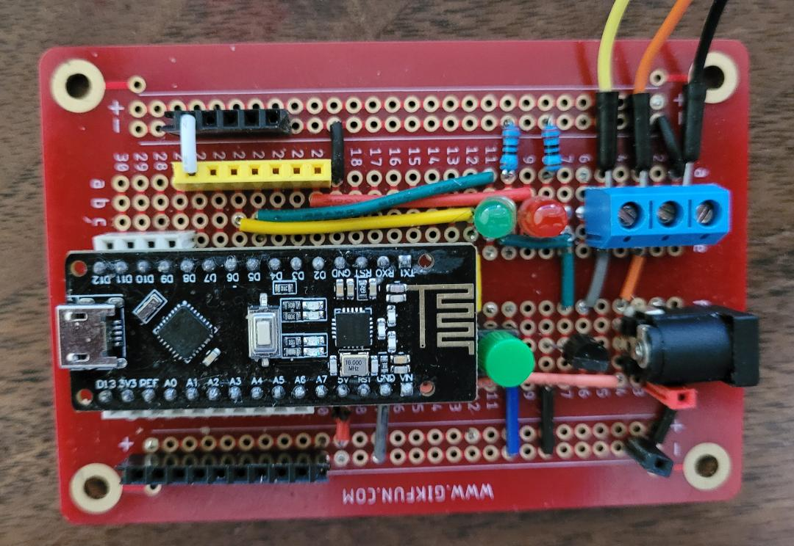
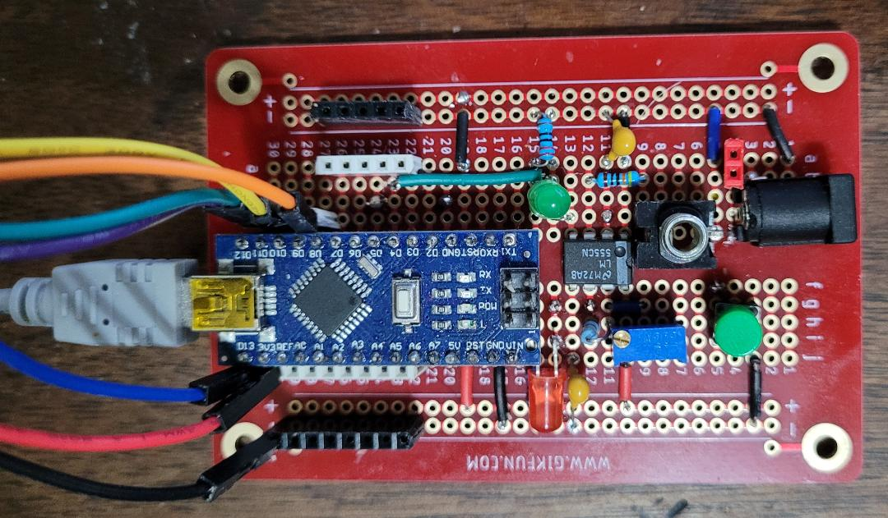

# morseR24

An Arduino sketch that converts text to Morse code and other formats, outputs to GPIO, and can transmit message to slave devices using an nRF24L01 radio.

It supports up to 4 radio channels and 4 selectable device IDs.

## Hardware requirements

This project was developed using the Arduino Nano V3, and a compatible board with integrated nRF24L01 radio. Some other Arduinos may work, but they must have analog input pin A7. So, for instance, the Uno won't work.

## Software requirements

You must install the RF24 library from TMRh20,Avamander version 1.4.7 or greater.

## Initialization

Upload **morse.ino**. The sketch will work initially with Arduino factory settings. If the stored message or timing settings are incorrect, upload **eeprom_reset.ino** to reset the EEPROM. Then reupload **morse.ino**.

## CE and CSN pins

If using an external radio, wire CE to pin 10 and CSN to pin 9. This sketch supports integrated boards and that's what they use.

## Circuit considerations

The output pin is D5 and the inverted output is D3.

### PWM wiring

The output pins support PWM. This is controlled by the voltage on pin A7, which is usually wired to +5V. If you leave A7 unconnected, you will get erratic results. On the Nano V3, it is easy to wire A7 to +5V because the two pins are right next to each other. In most cases that's what you will do unless you really want to use PWM.

### Indicator LED

Optionally connect a red LED from pin D2 via a current-limiting resistor to ground. This is used to indicate error and operating conditions (see below).

### Code key switch

Optionally connect pin D6 to ground via a normally-open pushbutton switch.

## Red LED signals

Single 1/10 second blink following reset:
- If seen, radio is enabled and connected properly.
- If not seen, radio is disabled.

Continuous fast blink:
- Radio is enabled but not connected properly.

Short blink during message display:
- Invalid character in the message. (**\*** will also be printed after the character in the serial monitor.)

Solid red:
-  If the red LED lights immediately, slave mode is enabled and the radio is disabled. This is an unsupported configuration.
-  If the red LED lights during transmission of a message, an invalid packet was received. Ensure that the transmitter and the receiver are running the same version and that there is good radio communication. The problem should be investigated and the slave reset.

## Test configuration

With pin D7 jumpered to ground:
- If the push button is pressed during reset, the button will subsequently act as a code key for manual input.
- If the push button is not pressed during reset, the output/transmission will blink continuously every 1 second.

With pin D7 not jumpered to ground:
- Pressing and holding the pushbutton enters test mode. The button will subsequently act as a code key for manual input.
 
## Radio configuration

### Channel setting

The nRF24L01 supports wireless channels 0-125. **morseR24** supports 4 channels, from 88 to 118 in increments of 10. The channel is specified using jumpers on pins A2, A3. If none of these are wired to ground, the channel defaults to 118. See the code for more details.

### Device ID setting

The sketch supports 4 device IDs, selected by jumpers on pins A4, A5. See the code for more details.

### Power setting

The radio power is set by jumpers on pins A0, A1. The default is MAX. See the code for more details
                                                                                                                             
## Modes of operation

### Master (transmitter) mode

For master mode, leave pin D8 unconnected.

The maximum message length is 150 characters.

The message to transmit is entered in the serial monitor console. It accepts multiple lines (as the serial input buffer can only accept 63 characters at a time) and concatenates them together. The partial message is displayed followed by a '<' symbol indicating that more text can be entered. Enter a blank line to commit the message.

The following in-line characters will cause the text to be interpreted in several different ways:

- Morse code (the default, or preceded by an underscore **_** )
- Unary (using the **#** character). For example, **#314159**
- Hexadecimal (using the **$** character). For example, **$600DF00D**
- Chess coordinates (using the **%** character). For example, **%e2e4 e7e5**

You can change these in-line modifiers mid-text.

The timings can be changed using the "star commands." For example:

- **\*s100** changes the dot length to 100 ms
- **\*p3000** changes the inter-message pause to 3000 ms

The command will be transmitted to the slave. Issuing one of these commands will interrupt and restart any broadcast in progress.

#### Standalone operation

If you just want to control something with GPIO, you can operate in master mode without a radio. But in that case you must wire pin D4 to ground to disable the radio.

### Slave (receiver) mode

For slave mode, wire pin D8 to ground.

The serial monitor will display the characters as they are output, as well as any speed and pause timing changes.

## Example circuits

### External device control

This example uses an integrated Nano V3 + nRF24L01 board. Here, the output D5 drives the gate of a 2N7000 MOSFET in open drain configuration, that can then be used to control an external circuit.

Similarly, the inverted output D3 could be used to drive a P-channel MOSFET such as the IRF9540.

### Tone generator

Here, an LM555 timer in astable mode generates a tone that is sent to a mono audio jack. The GPIO output on pin D5 is sent to pin 4 (active low reset) of the LM555 to modulate the signal. This example uses a Nano V3 (compatible) with external radio connected to the SPI bus. This circuit can be used in master mode (with or without radio) or slave mode.

