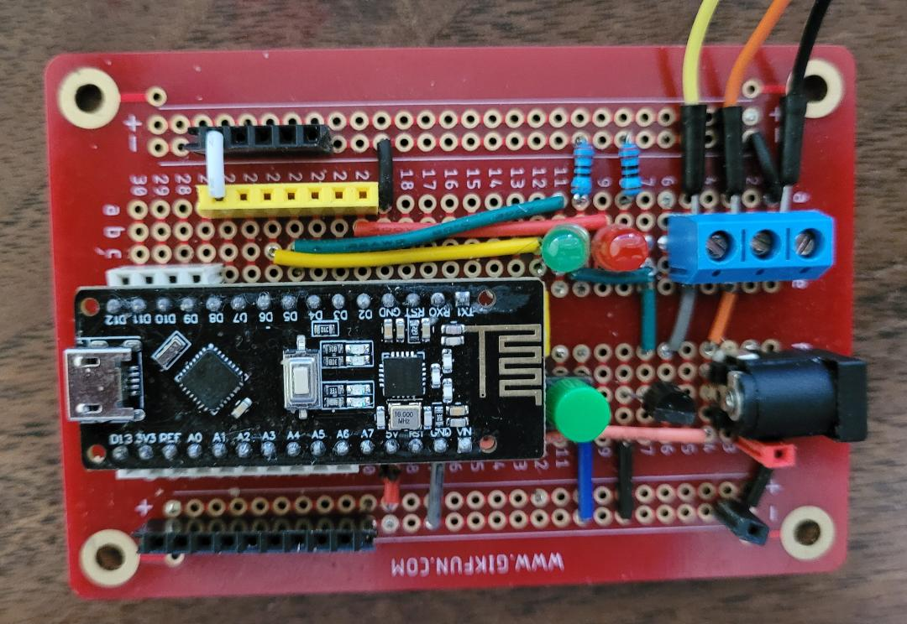
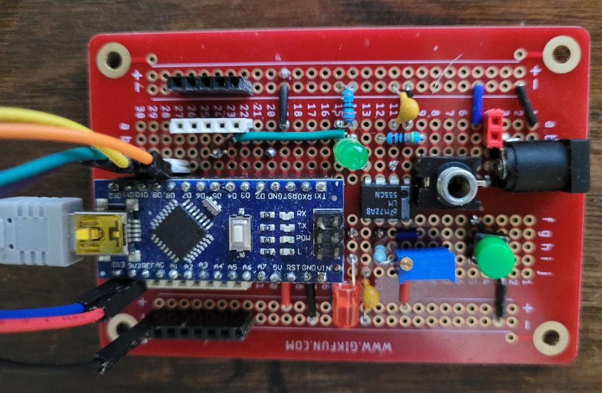

# morseR24

Send Morse code to GPIO pin and optional RF24 radio

This version transmits the entire message to the receiver. The receiver stores it in its EEPROM.

## Initialization

This code will work with a fresh Arduino from the factory. The EEPROM location 0 must contain the value 0xFF initially, in order for it to initialize the speed and pause to their initial default values. If something gets messed up, the best thing to do is run eeprom_reset.ino. This will clear the EEPROM to all 0xFF values. Then reupload the sketch and life is good.

## Hardware

This project requires the Arduino Nano3 and/or a Nano board with an integrated radio. Other boards may work, but they must have A7 analog input. So a Uno won't work.

## PWM wiring

The output pins D5 and inverted output D3 support PWM, if you really need it. This is controlled by the voltage on pin A7, which is usually wired to +5V. If you leave A7 unconnected, you will get erratic results. On the Nano3, it is easy to wire A7 to +5 because the two pins are right next to each other. In most cases that's what you will do unless you really want to use PWM.

## CE and CSN

The important point for the integrated board is that you must use CE=10 and CSN=9. Most resources on the Internet suggest radio(9, 10) or some other pins. That's fine if you are using an external radio, but it took me some time to figure this out. I had to follow the traces on the PCB and compare the pinout with the nRF24L01 chip on the integrated board to see that they actually have to be reversed. I couldn't find any explanation of this anywhere, so here it is.

## Error conditions

The red LED (pin D2) indicates the following:

It will blink once for 1/10 second upon initiation to indicate that the radio is operational.

Fast blink: Radio is not connected properly. You can use this code without a radio, if you just want to control something from the GPIO pin. But in that case you need to wire pin D4 to ground to disable the radio.

Solid red can mean one of two things:

-  If it happens immediately, that means you are configured as a receiver and the radio is disabled. This is obviously a limited configuration because it can only replay what's already in its EEPROM, not receive new messages.
    
-  If it happens during transmission of a message, the PIN_RED will light up on the slave to indicate a bad checksum of the data packet. This can be cleared by retransmitting the data from the master.

## Test mode

There are two ways to enter test mode:

1.  Wire pin D7 to ground. When the Arduino is reset, the output will blink continuously each 1 second. This is useful if you are in a different room, for instance.

If you hold down the button during the reset, then the button will act as a code key for manual input.

2.  In normal operation (D7 not wired to ground), you can enter test mode by holding down the button until the next loop starts. In this case, the button will act as a code key for manual input. To get out of test mode, you have to reset the Arduino.

## Hardware examples

Here is one way to wire up the Arduino. This is using an integrated board. In this circuit, the output drives the gate of a 2N7000 MOSFET (open drain) which can then be used to control an external circuit.

The next circuit uses a 555 to generate a tone that is sent to an audio jack. The Morse signal is sent to pin 4 (active low reset) of the 555 to turn the tone on and off. This configuration uses a regular Nano3 and external radio (not shown). In this configuration it might be useful to remove and disable the radio, because it's mainly just a Morse tone generator.

