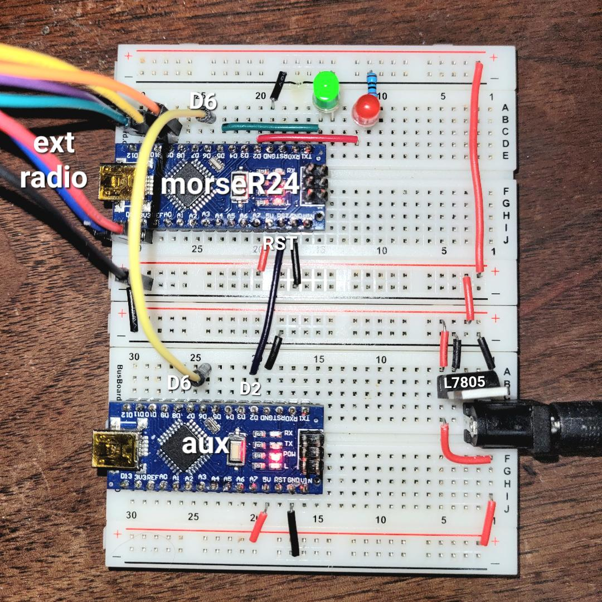

# Auxiliary control from secondary device

By utilizing test mode, a device *A* running *morseR24* can be used as an auxiliary radio from a secondary device *B* running different code. Here's how you might do that, assuming *B* is another Arduino:

To avoid confusion, we will write pins as A_D7 or B_D7, etc.

* Wire pin A_D7 on *A* to GND (test mode)
* Connect any output pin (say B_D6) of *B* to pin A_D6 on *A* (code key switch)
* Connect any output pin (say B_D2) of *B* to A_RST on *A*

On *B*:

* Assert B_D6 and B_D2 _HIGH_initially
* Reset A by asserting B_D2 LOW for 10ms
* Send data to A using B_D6, which is wired to the code key pin on A

